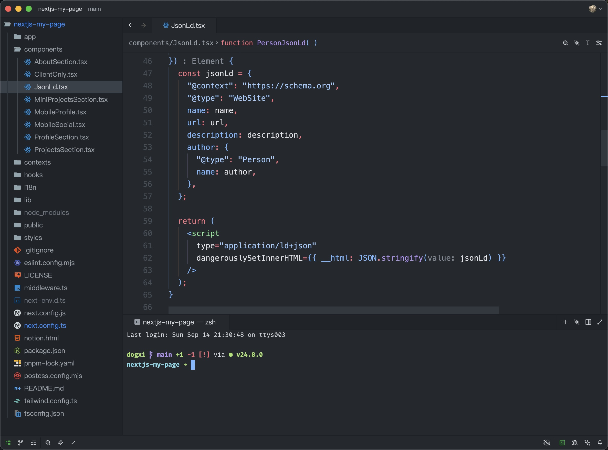

# Dogxi_Theme_Zed

Zed theme for personal use

Copy `Dogxi Theme.json` to `~/.config/zed/themes`

```bash
cp "Dogxi Theme.json" ~/.config/zed/themes/
```




My configuration:

- UI and editor font: PingFang SC
- Terminal font: [FiraCode Nerd Font](https://www.nerdfonts.com/font-downloads)
- Terminal prompt: [Starship](https://starship.rs/)

based on [Github-Classic-Theme-Zed](https://github.com/meocoder31099/Github-Classic-Theme-Zed)
